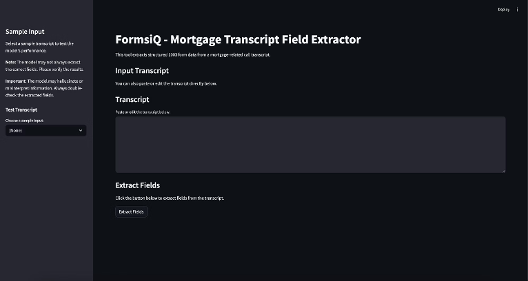

# FormsiQ – Mortgage Transcript Field Extractor

=====================================

=====================================

FormsiQ is an AI-powered application that extracts structured field data from mortgage call transcripts using Google Gemini. It supports mapping fields to the official **1003 Uniform Residential Loan Application (URLA)** format and includes confidence scoring, error handling, and unmapped field logging for full traceability.

---

## Features

- Structured field extraction from free-form transcripts
- Confidence scores assigned for every extracted field (0.0 to 1.0)
- Official 1003 field name mapping with fallback logging for unmatched fields
- Streamlit UI for interactive testing and demo
- FastAPI backend with simple JSON POST interface
- Handles vague or ambiguous inputs without hallucinating data
- Logs unmapped or nonstandard field names to a debug file
- Synthetic test prompts included for edge-case validation

---

## How it Works

### Input

- User pastes or selects a **mortgage call transcript**

### Extraction

- Gemini 1.5 generates a JSON response using a carefully crafted prompt
- Output includes:
  - `field_name`
  - `field_value`
  - `confidence_score` (0.0 to 1.0)

### Output

```json
{
  "fields": [
    {
      "field_name": "Loan Amount",
      "field_value": "$350,000",
      "confidence_score": 1.0
    }
  ]
}
```

---

## Fallback Handling

- If a Gemini-generated field name doesn’t match the 1003 form:
- - It’s stored in unmapped_fields_log.txt
- - This helps you track hallucinated or nonstandard values during testing


## Sample Output Format

```json
{
  "fields": [
    {
      "field_name": "Loan Amount",
      "field_value": "$300,000",
      "confidence_score": 1.0
    },
    {
      "field_name": "Pet Name",
      "field_value": "Luna",
      "confidence_score": 0.6
    }
  ]
}
```
---

## Project Structure

```
├── app.py                   # Streamlit 
├── utils/
│   ├── api.py               # FastAPI 
│   ├── extractor.py         # Field extraction logic
│   ├── field_map.py         # 1003 form mapping dictionary
│   └── sample_prompts.py    # Test prompts
├── test_result/             # run_test file gets saved
├── run_tests.py             # Script for bulk testing edge cases
├── unmapped_fields_log.txt  # Unmapped fields are logged in unmapped_fields_log.txt for debugging
├── requirements.txt
└── README.md

```
---

## How Confidence Works

- Pattern Matching: Detects direct keyword-value relationships (e.g., “I need a loan of $300,000” → 1.0).
- Sentence Structure: Evaluates certainty, hesitancy, or speculation in phrasing (e.g., “maybe around $300k” → 0.65).
- ≤ 0.5 → Vague, speculative, or conflicting information
- Proximity & Clarity: Scores higher when field-value pairs are close and unambiguous in context.

---

## How to Run

```bash
# 1. Clone the repo and install dependencies:
- git clone https://github.com/rishabh15b/FormsiQ
- pip install -r requirements.txt

# 2. Add your Gemini API key to a .env file:
- GEMINI_API_KEY=your-api-key-here

# 3. Run the backend:
- uvicorn api:app --reload

# 4. In another terminal, run the Streamlit app:
- streamlit run app.py

```
---

## Important Notes

- Only clearly stated fields are extracted — no guessing.
- Confidence score is dynamic (0.0–1.0) based on sentence clarity.
- Hallucinated or irrelevant fields are filtered and logged.
- Mapping is strictly based on 1003 form + fallback for custom fields.
- Output is clean, structured, and directly usable.
- Edge and vague cases are synthetically tested.

---

## Author

- Developed by [Rishabh Balaiwar](https://github.com/rishabh15b). Feel free to reach out for questions or collaboration opportunities!

---

## Contact

- For support or inquiries, contact me at:
- Email: <rbalaiwar@gmail.com>
- GitHub: [Your GitHub Profile](https://github.com/rishabh15b)
